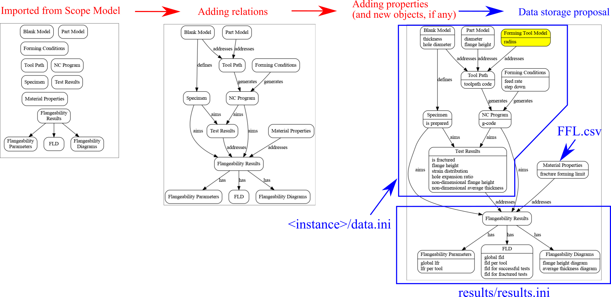
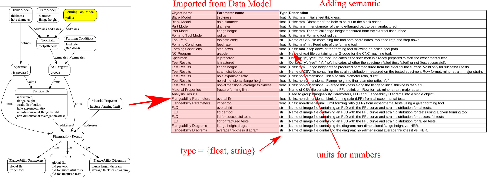
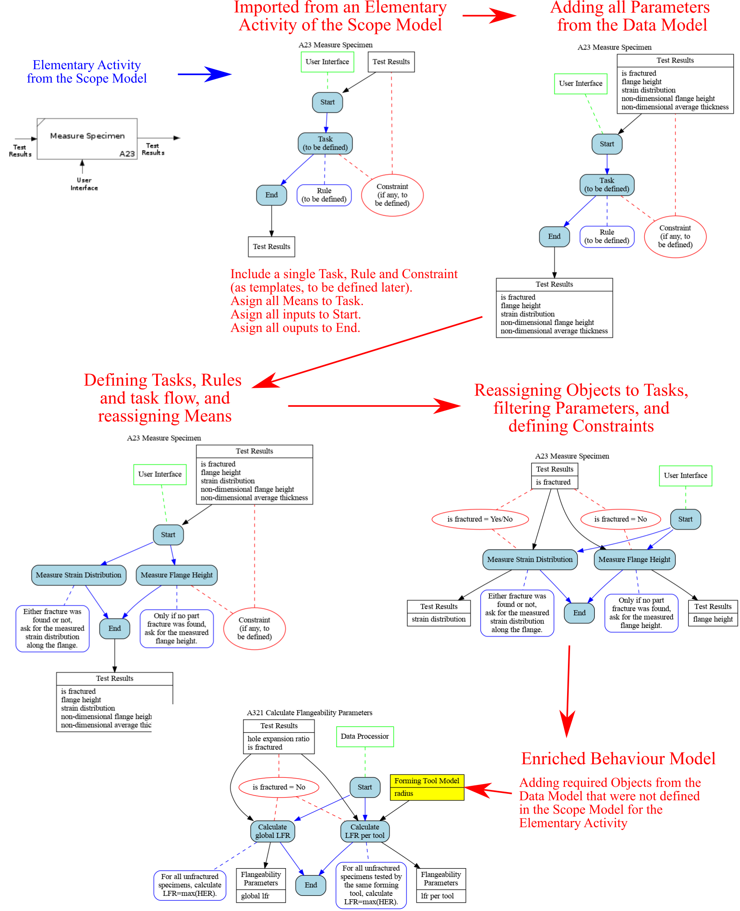

# MfM case study: hole flanging by SPIF in a single stage

## Ontology Layer

### Scope Model

### Data Model

### Semantic Model

### Behaviour Model

Workflow to build a Behaviour Model for an Elementary Activity:

Overview:

Checking the consistency of the Behaviour Model:

### Simulation Application

Modelling Actions from the Behaviour Model:

### MLM vaulting

