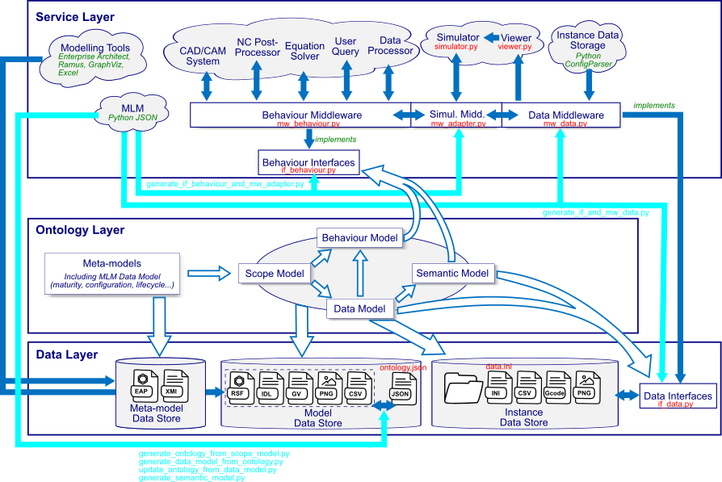

# MfM case study: hole flanging by SPIF in a single stage

## 3-Layer Model (3LM) Overview

## Service Layer

It comprises the software tools to simulate the application.

## Ontology Layer

See [Ontology_Layer/README.md](Ontology_Layer/README.md)

## Data Layer

### `Data_Layer/files`

Directory that contains all original complementary files required to perform the MfM simulation (CAD/CAM models, Finite Element models, tables with material properties, etc.).

### `Data_Layer/<instance_name>/data.ini`

Configuration file with all the instance data. 
Example of a configuration file:

    [Blank Model]
    thickness = 1.6
    hole diameter = 64.5
    
    [Part Model]
    diameter = 95.8
    flange height = 15.65
    
    [Forming Tool Model]
    radius = 6.0
    
    [Forming Conditions]
    feed rate = 1000.0
    step down = 0.2
    
    [Material Properties]
    fracture forming limit = files/fracture_forming_limit.csv
    
    [Tool Path]
    toolpath code = toolpath.csv
    
    [NC Program]
    g-code = nc-program.gcode
    
    [Specimen]
    is prepared = y
    
    [Test Results]
    is fractured = n
    flange height = 23.6
    strain distribution = strain.csv
    hole expansion ratio = 1.4852713178294574
    non-dimensional flange height = 0.24634655532359084
    non-dimensional average thickness = 0.6631355932203389
    
    [Flangeability Parameters]
    overall lfr = 1.4852713178294574
    lfr per tool = 1.4852713178294574
        
    [FLD]
    overall fld = FLD_successful_tests.png
    fld per tool = FLD_R6.png
    fld for successful tests = FLD_successful_tests.png
    fld for fractured tests = FLD_failed_tests.png
        
    [Flangeability Diagrams]
    flange height diagram = diagram_HER-h.png
    average thickness diagram = diagram_HER-t.png

## Interfaces and Middleware

The following files are automatically generated from the ontology model:

- `Service_Layer/if_data.py`
- `Service_Layer/if_behaviour.py`
- `Service_Layer/mw_data.py`
- `Service_Layer/mw_adapter.py`

### `Service_Layer/if_data.py`

File generated automatically.

Python interfaces with instructions for implementing the Data Model.

### `Service_Layer/if_behaviour.py`

File generated automatically.

Python interfaces with instructions for implementing the Behaviour Model.

There is a interface for each `Task` of the `Elementary Activities`.
The interface structure is generated from the definition of the `Task` as:

    def <task>(
            <input_1>: type, 
            ...
            <input_n>: type
            ) -> output type:
        '''
        Comments section with instructions for implementing the interface:
        <rule>
        <input>
        <output>
        <constraint>
        '''
        pass

### `Service_Layer/mw_data.py`

File generated automatically.

Implementation of `Service_Layer/if_data.py` to retrieve/save the instance data from/to `Data_Layer/<instance_name>/data.ini`.

`data.ini` is backed up as `data_<timestamp>.ini` before running a simulation.

### `Service_Layer/mw_adapter.py`

File generated automatically.

The Behaviour Layer is completely decoupled from the Data Layer such that both can interact only via the mediating controller.

### `Service_Layer/mw_behaviour.py`

Implementation of `Service_Layer/if_behaviour.py` that can call scripts or batch files to execute the tasks using external software. Examples:

1. A Python script to calculate the flange height
2. A CATIA VBA script to update the flange height of the design part. 
3. A Python script to update the ABAQUS model and run the simulation.

## Simulation Application

### `Service_Layer/viewer.py`

`Visualization` class with methods to display information of data instances.

### `Service_Layer/simulator.py`

`Simulation` class with methods to perform a MfM simulation from the command line.

## `main.py`

Python script to call `Service_Layer/simulation.py`.

## `main.ipynb`

Jupyter notebook to run `main.py` in the cloud via mybinder:

