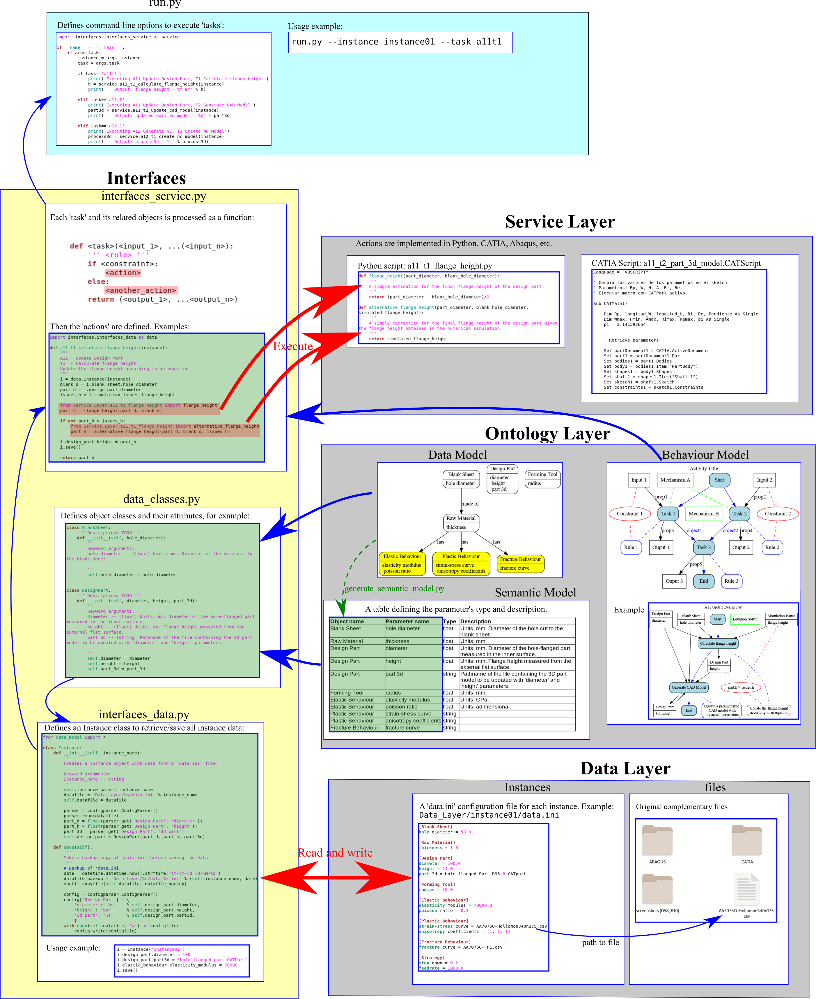

# MfM case study: hole flanging by SPIF in a single stage

## 3-Layer Model Overview

Warning: the following figure is obsolete.

## Ontology Layer

See [Ontology_Layer/README.md](Ontology_Layer/README.md)

## Data Layer

### `files`

All original complementary files required to perform the MfM simulation (CAD/CAM models, Finite Element models, tables with material properties, etc.) are stored in the directory `Data_Layer/files`.

### `data.ini`

A directory `Data_Layer/<instance_name>` must be created for every instance that must contain a configuration file `data.ini` with all the instance data. 
Example of a configuration file:

    [Blank Model]
    thickness = 1.6
    hole diameter = 63.5
    
    [Part Model]
    diameter = 95.8
    flange height = 16.15
    
    [Forming Tool Model]
    radius = 6.0
    
    [Tool Path]
    toolpath code = toolpath.csv
    
    [Forming Conditions]
    feed rate = 1000.0
    step down = 0.2
    
    [NC Program]
    g-code = nc-program.gcode
    
    [Specimen]
    is prepared = y
    
    [Test Results]
    is fractured = y
    flange height = 0.0
    strain distribution = strain.csv
    hole expansion ratio = 0.0
    non-dimensional flange height = 0.0
    non-dimensional average thickness = 0.0
    
    [Material Properties]
    fracture forming limit = files/fracture_forming_limit.csv
    
    [Analysis Results]
    
    [LFR]
    global lfr = 0.5991735537190083
    lfr per tool = 0.0
    
    [FLD]
    global fld = FLD.png
    fld per tool = TBD
    fld for successful tests = TBD
    fld for fractured tests = TBD
    
    [Technological Parameters]
    flange height diagram = TBD
    average thickness diagram = TBD
    
    [Conclusions]
    limit forming ratio = 
    flange height = 
    average thickness = 
    bending ratio = 

## Service Layer

Scripts or batch files to execute the tasks using external software. Examples:

1. A Python script to calculate the flange height
2. A CATIA VBA script to update the flange height of the design part.
3. A Python script to update the ABAQUS model and run the simulation.

## Interfaces

An `interfaces` directory that contains:

### `interfaces_data.py`

Python classes/functions to retrieve/save the instance data from/to `data.ini`.
A backup of `data.ini` is made as `data_<timestamp>.ini` before running a simulation.

### `interfaces_service.py`

Python functions to implement the Behaviour Model using the scripts/batch files in the `Service Layer`.

There is a function for each `Task` of the `Elementary Activities`.
The function structure is generated from the definition of the `Task`:

    def <task>(<input_1>, ...(<input_n>):
        ''' <rule> '''
        if <constraint>:
            <action>
        else:
            <another_action>
        return (<output_1>, ...<output_n>)

where `<action>` is a call to a script/batch file in `actions`.

    

## `simul.py`

Python script to perform a MfM simulation from the command line.

## `simul.ipynb`

Jupyter notebook to run `simul.py` in the cloud via mybinder:

